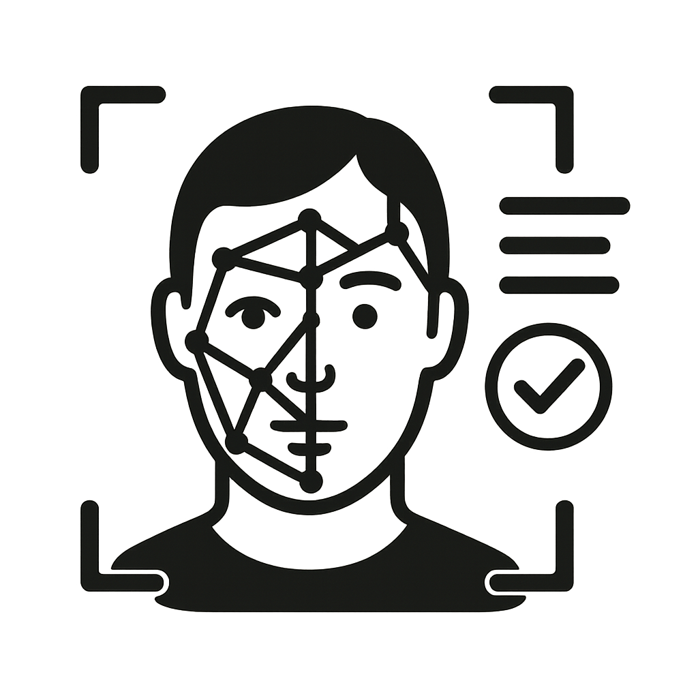
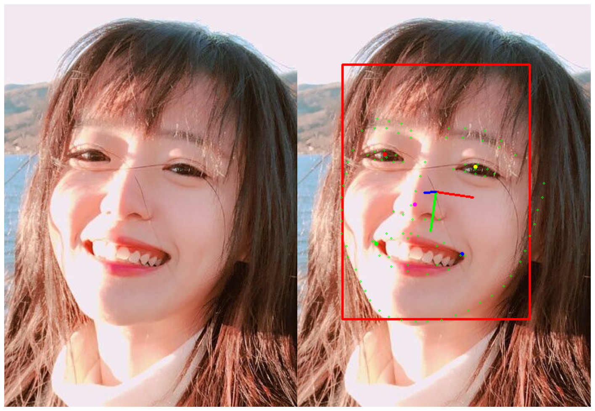

<div align="center">


[](https://pypi.org/project/cvglue/) 
[](LICENSE)

**中文简体** | [**English**](./README_EN.md)

</div>

----
CVGlue 是一个计算机视觉工具包。集成了人脸检测、姿态估计、质量评估等任务，提供统一的 OpenCV/PyTorch 数据处理接口，支持数据集自动化标注。


## ✨ 核心功能

**开箱即用**：统一接口调用多算法  
**高效可视化**：Jupyter 单行代码多格式图像显示（OpenCV/PIL/Tensor/文件路径）  
**数据集支持**：衔接 [IAP 数据集](https://github.com/Lamply/IAPDataset) 标注流程

| 类别 | 能力 | 支持算法 |
|------|------|----------|
| **人脸分析** | 人脸检测/关键点/姿态估计 | RetinaFace, AdaptiveWingLoss, FSA-Net |
| **质量评估** | 人脸质量评分 | TFace FIQA |
| **数据工具** | 图像预处理/可视化/标注 | OpenCV & PyTorch 封装 |
| **扩展模块** | 图像修复/通用分割 | LaMa, SegmentAnything (开发中) |


## 🚀 快速示例

创建一个 jupyter-notebook

```python
import cv2
import cvglue
from cvglue import displayer as display

parser = cvglue.parser.get_parser("lamply-faceid")
img = cv2.imread("tests/data/images/single_face_img.jpg")

anno = parser.parse_img(img)
iap_data = (img, anno)
img_disp = display.render_lamply(iap_data)
display.show([img, img_disp])
```

得到

<div align="center">

</div>


## ⚙️ 安装

```bash
pip install cvglue
```

一些较大的模型需要自行下载放置到 `TORCH_HOME` 路径下：
- `Resnet50_Final.pth`：https://github.com/biubug6/Pytorch_Retinaface
- `WFLW_4HG.pth`：https://github.com/protossw512/AdaptiveWingLoss
- `SDD_FIQA_checkpoints_r50.pth`：https://github.com/Tencent/TFace
- `FBCNN`: https://github.com/jiaxi-jiang/FBCNN/releases/download/v1.0/fbcnn_color.pth


## 🔌 第三方集成表

| 第三方代码             | 状态  | 用处             | 原项目链接                                                      |
| ----------------- | --- | -------------- | ---------------------------------------------------------- |
| FaceDetector      | ✅   | 人脸检测           | https://github.com/biubug6/Face-Detector-1MB-with-landmark |
| AdaptiveWing      | ✅   | 人脸关键点检测        | https://github.com/protossw512/AdaptiveWingLoss            |
| HeadPoseDetector  | ✅   | 头部姿态检测         | https://github.com/shamangary/FSA-Net                      |
| TFace             | ✅   | 人脸质量评价         | https://github.com/Tencent/TFace                           |
| LaMa              | ⏳   | 图像修复           | https://github.com/advimman/lama                           |
| FBCNN             | ✅   | JPEG压缩修复       | https://github.com/jiaxi-jiang/FBCNN                       |
| SegmentAnything   | ⏳   | 通用分割           | https://github.com/facebookresearch/segment-anything       |
| InsightFace       | ✅   | faceid 提取/人脸属性 | https://github.com/TreB1eN/InsightFace_Pytorch             |
| AttributeDetector | ✅   | 人脸属性           | https://github.com/ageitgey/face_recognition               |

